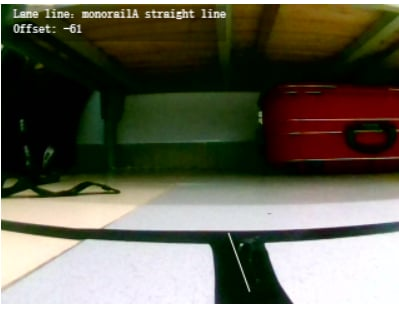
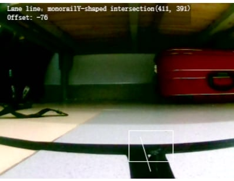
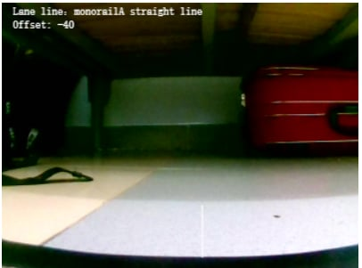
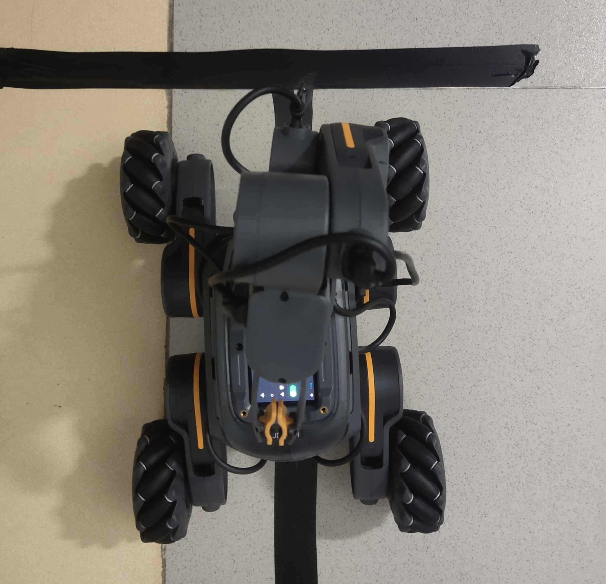

# UGOT 
## Các loại đường đơn
1. Đường thẳng.
2. Đương chữ Y (ngã 3).
3. Hai đường giao nhau (ngã 4).
4. Không có đường.

## Những vấn đề
1. Khoảng cách nhận diện giao điểm

  

    
    
Trước khi nhận diện được giao điểm

  

  

    
    
Khi nhận diện được giao điểm

  

  

    
    
Khi kết thúc nhận diện được giao điểm

  

Ở trên là giao diện về cách UGOT nhận dạng giao điểm (ngã 3 và ngã 4)
Ta có thể dễ dàng nhận ra rằng khoảng cách mà UGOT bắt đầu nhận dạng được và khoảng cách UGOT kết thúc nhận diện là hoàn toàn ngẫu nhiên. Thêm nữa vì khi hết nhận diện thì UGOT không nằm ngay trên điểm giao mà nằm lệch về phía trước điểm giao.

  

    
    
Vị trí của UGOT sau khi kết thúc nhận diện giao điểm

  

  

Vậy nhiệm vụ là đưa UGOT đến vị trí giao điểm.   

Những giải pháp đã thử:  
- Khi nhận diện được giao điểm thì đi thẳng với vận tốc v trong t giây.
    * Ưu điểm: Đơn giản.
    * Nhược điểm: Độ chính xác thấp và thậm chí có thể bị lệch hoàn toàn.
- Khi nhận diện được giao điểm thì đi cho đến khi hết đường hoặc gặp đường thẳng
    * Ưu điểm: Độ chính xác cao hơn.
    * Nhược điểm: Độ phức tạp bài toán cao.

Hiện tại thì cách khả quan nhất là cách 2.  

2. Tốc độ (bao gồm tốc độ di chuyển và tốc độ quay)
- Tốc độ di chuyển
    * Tốc độ cao: Không thể giữ xe thẳng hàng với line.
    * Tốc độ thấp: Không thể đáp ứng điều kiện thời gian và có thể không qua được cầu.
- Tốc độ quay
    * Tốc độ quay cao: Xe dừng lại để sửa góc lâu hơi vì quán tính lơn.
    * Tốc độ quay chậm: Tốc độ sửa góc chậm.

3. Camera không ổn định:   
Trong lúc di chuyển, các vệt sáng lóa hoặc dị vật của mặt đường có thể làm UGOT nhận dạng sai loại đường (ví dụ đường thẳng nhận thành ngã 3, ngã 4 và ngược lại).  
- Hướng giải quyết (chưa thử): UGOT chỉ nhận loại đường khi nó xuất hiện trong một khoảng thời gian (interval), nếu thời gian xuất hiện của loại đường bé hơn interval thì ta không nhận (hay ta coi nó là một sai số của camera).  
- Nhược điểm: Thời gian xử lý sẽ lâu hơn.  

## Cách giải quyết chung cho những vấn đề trên: Tích hợp sẵn UGOT di chuyển

* Logic: Chúng ta dựa vào khoảng cách mà xe đã di chuyển để quyết định hành vi của UGOT. Ví dụ chuỗi hành động (dist là khoảng cách UGOT đã di chuyển).
    - Khi 0 < dist < 200 (cm): UGOT đi thẳng và giữ xe thẳng với line.
    - Khi dist == 200 (cm): Rẽ phải.
    - Khi 200 < dist < 400: Đi thẳng.
    - Khi dist == 400: Rẽ trái.
    - ...

* Vấn đề: Ta cần biết thời gian UGOT di chuyển để tính khoảng cách (s = v.t), mà uCode4 không có cách để tính thời gian.
    + Hướng giải quyết 1: Cho UGOT di chuyển với vận tốc v trong thời gian t.
        - Nhược điểm: Trong lúc di chuyển thì những tính năng khác của UGOT bị đóng băng.
    + Hướng giải quyết 2: Cho hành vi của UGOT luôn ở dạng [di chuyển trong t1 giây, dừng, chỉnh sửa offset trong t2 giây, lặp lại...].
        - Nhược điểm: Cần phải căn chỉnh t1 và t2 để đạt yêu cầu.

## Vấn đề gắp bóng (Để sau)
* Logic: Sử dụng block nhận dạng hình dáng vật thể và màu sắc trong ucode.
* Vấn đề gặp phải: Căn chỉnh cánh tay và khoảng cách từ UGOT đến bóng cho phù hợp.

